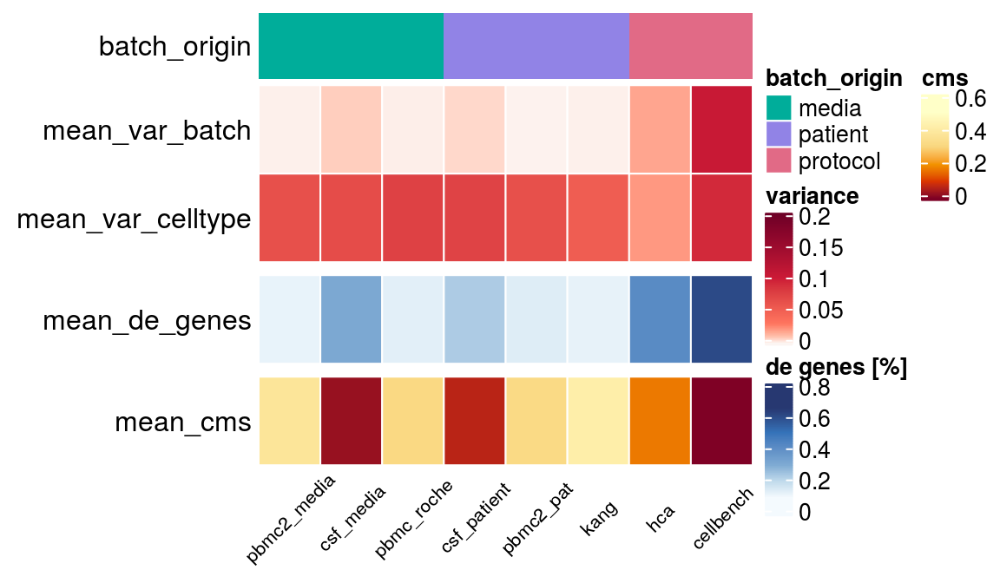

A systematic analysis of different kinds of unwanted varaition in single cell RNAseq datasets.

# Analysis

## Batch effects
+ [cellbench](batch_effect_cellbench.html)
+ [pbmc_roche](batch_effect_pbmc_roche.html)
+ [pbmc2_pat](batch_effect_pbmc2_pat.html)
+ [pbmc2_media](batch_effect_pbmc2_media.html)
+ [kang](batch_effect_kang.html)
+ [hca](batch_effect_hca.html)
+ [pancreas](batch_effect_pancreas.html)
+ [csf_patient](batch_effect_csf_patient.html)
+ [csf_media](batch_effect_csf_media.html)

## Simulation
+ [cellbench](simulation_cellbench.html)
+ [pbmc_roche](simulation_pbmc_roche.html)
+ [pbmc2_pat](simulation_pbmc2_pat.html)
+ [pbmc2_media](simulation_pbmc2_media.html)
+ [kang](simulation_kang.html)
+ [hca](simulation_hca.html)
+ [pancreas](simulation_pancreas.html)
+ [csf_patient](simulation_csf_patient.html)
+ [csf_media](simulation_csf_media.html)

## CountSimQC
+ [cellbench](countSimQC_cellbench.html)
+ [pbmc_roche](countSimQC_pbmc_roche.html)
+ [pbmc2_pat](countSimQC_pbmc2_pat.html)
+ [pbmc2_media](countSimQC_pbmc2_media.html)
+ [kang](countSimQC_kang.html)
+ [hca](countSimQC_hca.html)
+ [pancreas](countSimQC_pancreas.html)
+ [csf_patient](countSimQC_csf_patient.html)
+ [csf_media](countSimQC_csf_media.html)

## Visualize Simulations
+ [cellbench](vis_sim_cellbench.html)
+ [pbmc_roche](vis_sim_pbmc_roche.html)
+ [pbmc2_pat](vis_sim_pbmc2_pat.html)
+ [pbmc2_media](vis_sim_pbmc2_media.html)
+ [kang](vis_sim_kang.html)
+ [hca](vis_sim_hca.html)
+ [pancreas](vis_sim_pancreas.html)
+ [csf_patient](vis_sim_csf_patient.html)
+ [csf_media](vis_sim_csf_media.html)

# Summarized batch characteristics

## Real data
[Summary real data](overall_batch_characteristics.html)

## Simulations
+ [cellbench](simulation_cellbench.html)
+ [pbmc_roche](simulation_pbmc_roche.html)
+ [pbmc2_pat](simulation_pbmc2_pat.html)
+ [pbmc2_media](simulation_pbmc2_media.html)
+ [kang](simulation_kang.html)
+ [hca](simulation_hca.html)
+ [pancreas](simulation_pancreas.html)
+ [csf_patient](simulation_csf_patient.html)
+ [csf_media](simulation_csf_media.html)
[Summary simulated data](overall_sim_batch_characteristics.html)

# Datasets

Detailed information on reference datasets and preprocessing can be found [here](https://almutlue.github.io/batch_dataset/).

