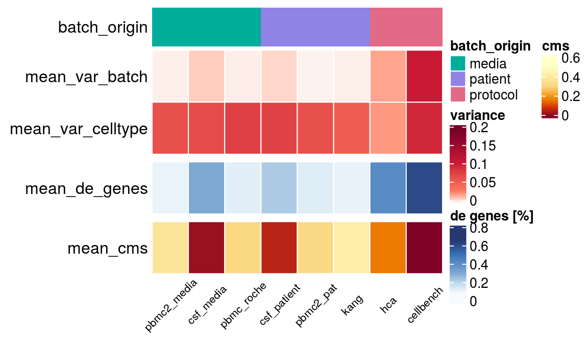

Besides the analysis of batch characteristics for a range of datasets we summarized major characteristics in more readable overview.
  
Overviews of batch characteristics of the simulated and real datasets are shown here: 

+ [overview_real_batches](overall_batch_characteristics.html)
+ [overview_simulated_batches](overall_sim_batch_characteristics.html)

Visualization of variance partition are shown here: 

+ [Variance partition real data](var_part_ct.html)
+ [Variance partition simulations](var_part_ct_sim.html)

