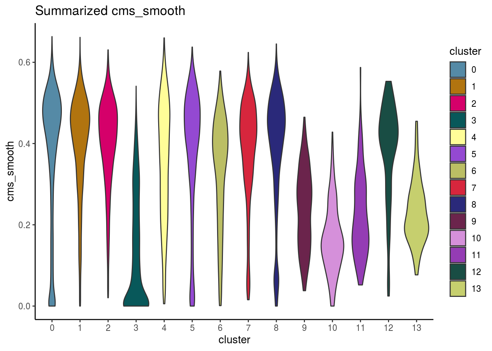

Batch effects and data integration are well known challenges in scRNAseq.
Still it's not well known how differences between batches/datasets are reflected
within the datastes features. 

Open questions are:

* Are batch effects/differences **celltype specific**?  
* How can we determine the **size/strength** of the differences?  
* Can we separate batch effects into groups of **"batch types"**?  
* Can we identify a subset of **"batch genes"** that are solely/specifically affected?  

Here we analyzed datasets with different sources of known batch effects and characterized their batch effects according to these questions.
  
Results of the analysis are shown here: 

```{r dataset name, include=FALSE}
sce_list = unlist(c(list(strsplit(params$data_names, ","))))
create_link <- c(
  "`r paste0('   + [', '{{sce_nam}}', '](batch_effect_', '{{sce_nam}}', '.html) ')`"
  )

sim_links <- lapply(sce_list, 
  function(sce_nam) knitr::knit_expand(text = create_link)
)
```


`r knitr::knit(text = unlist(sim_links))`



